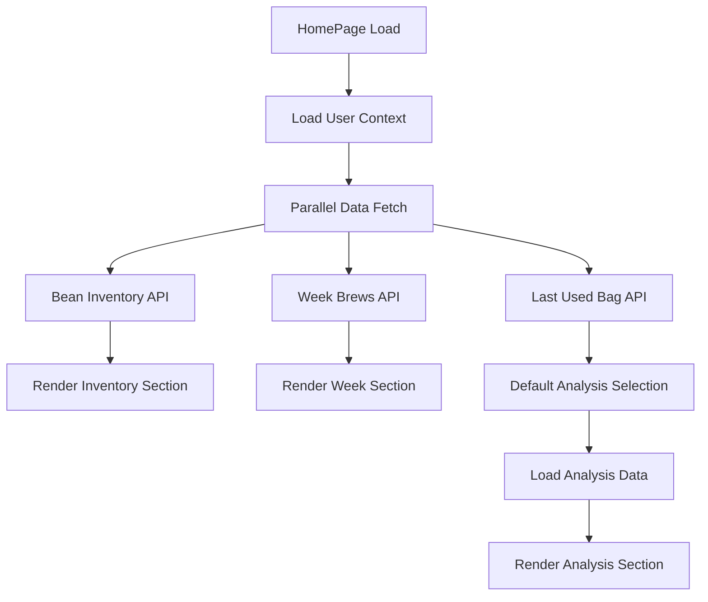
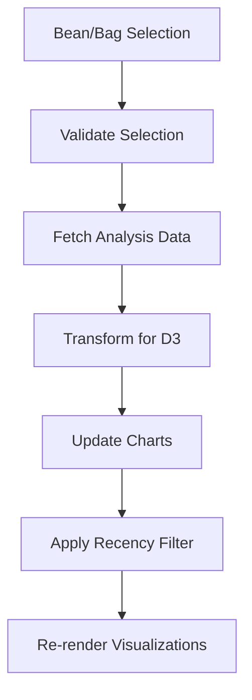

# Design Document

## Overview

The Home Page Dashboard transforms Espresso Engineered from a brews-first application to a comprehensive brewing companion that welcomes users with contextual awareness and immediate access to their brewing ecosystem. The dashboard integrates four key sections: contextual voice greeting, bean inventory management, community brewing activity, and analytical insights through interactive visualizations.

This design leverages the existing UI framework while introducing GSAP animations and D3 visualizations to create an engaging, material-driven experience that follows the established "typewriter on paper" aesthetic.

## Architecture

### Component Hierarchy

```
HomePage
├── VoiceGreeting (contextual messaging)
├── BeanInventorySection
│   ├── HorizontalBagList (GSAP animated)
│   └── EditableBagCard[] (existing component)
├── WeekInBrewingSection
│   ├── LayeredBrewCardGroup[] (GSAP animated)
│   └── BrewCard[] (existing component)
└── BeanAnalysisSection
    ├── BeanBagSelector (existing pattern)
    ├── ScatterPlotChart[] (D3 + UI viz framework)
    └── RecencyFilter (existing pattern)
```

### Navigation Architecture

The navigation system requires updates to make the home page the default destination:

1. **Route Updates**: Change default route from `/brews` to `/` (home)
2. **Logo Navigation**: Update header logo click to navigate to `/`
3. **Breadcrumb Addition**: Add "Go back home" links throughout the application
4. **Redirect Logic**: Update authentication redirects to point to home page

### Animation Framework Integration

GSAP will be integrated into the existing UI framework architecture:

```typescript
// New UI framework structure
ui/
├── foundations/
├── components/
├── behaviors/
├── viz/
└── animations/  // New GSAP integration
    ├── index.ts
    ├── transitions.ts
    ├── gestures.ts
    └── timeline.ts
```

## Components and Interfaces

### VoiceGreeting Component

**Purpose**: Provide contextual, time-aware greetings following the UI execution standard

**Interface**:
```typescript
interface VoiceGreetingProps {
  baristaName: string;
  lastBrewDate?: Date;
  timeOfDay: 'morning' | 'afternoon' | 'evening';
  hasRecentActivity: boolean;
}
```

**Behavior**:
- Displays contextually appropriate greeting based on time and user activity
- Uses Libre Baskerville font with `text.ink.muted` color
- Never applies italic styling
- Follows voice text patterns from UI execution standard

### BeanInventorySection Component

**Purpose**: Horizontal scrollable inventory management with status updates

**Interface**:
```typescript
interface BeanInventorySectionProps {
  bags: BagWithBean[];
  onBagUpdate: (bagId: string, updates: Partial<Bag>) => Promise<void>;
}

interface BagWithBean extends Bag {
  bean: Bean;
  emptied_on_date?: Date; // New field
}
```

**Behavior**:
- Displays bags in horizontal scrollable row
- Sorts by `last_used_date` descending
- Filters to show non-empty bags + bags emptied within current week
- Uses existing `EditableBagCard` components
- Implements GSAP animations for horizontal scrolling and card interactions

### WeekInBrewingSection Component

**Purpose**: Community activity display with layered card grouping

**Interface**:
```typescript
interface WeekInBrewingSectionProps {
  brews: BrewWithContext[];
  currentWeekStart: Date;
}

interface BrewWithContext extends Brew {
  barista: Barista;
  bean: Bean;
}

interface LayeredBrewGroup {
  barista: Barista;
  bean: Bean;
  brews: Brew[];
  stackDepth: number;
}
```

**Behavior**:
- Groups brews by barista + bean combination
- Displays as horizontally scrollable layered cards
- Implements GSAP animations for:
  - Card stacking/unstacking
  - Horizontal navigation
  - Layer transitions
- Uses existing `BrewCard` components within layered groups

### BeanAnalysisSection Component

**Purpose**: Interactive scatter plot analytics with filtering

**Interface**:
```typescript
interface BeanAnalysisSectionProps {
  selectedBean?: Bean;
  selectedBag?: Bag;
  onBeanChange: (bean: Bean | null) => void;
  onBagChange: (bag: Bag | null) => void;
}

interface ScatterPlotData {
  brews: BrewDataPoint[];
  xAxis: 'ratio' | 'brew_time_s';
  yAxis: 'rating';
}

interface BrewDataPoint {
  id: string;
  x: number;
  y: number;
  bagId?: string;
  date: Date;
}
```

**Behavior**:
- Defaults to user's last used bag
- Displays two aligned scatter plots (rating vs ratio, rating vs brew time)
- Differentiates bags by color when bean selected without specific bag
- Provides recency filtering (2D, W, M, 3M, Y)
- Uses D3 within UI framework's viz system

## Data Models

### Database Schema Extensions

**Bags Table Addition**:
```sql
ALTER TABLE bags ADD COLUMN emptied_on_date TIMESTAMPTZ;
```

**TypeScript Schema Updates**:
```typescript
interface Bag {
  // ... existing fields
  emptied_on_date?: string; // ISO date string
}
```

### API Endpoints

**New Endpoints**:
```typescript
// Bean analysis data
GET /api/brews/analysis?bean_id={id}&bag_id={id}&recency={period}
Response: {
  brews: BrewDataPoint[];
  bean: Bean;
  bag?: Bag;
}

// Week in brewing data
GET /api/brews/week?week_start={date}
Response: {
  groups: LayeredBrewGroup[];
  week_start: string;
}

// Bean inventory data
GET /api/bags/inventory?barista_id={id}
Response: {
  bags: BagWithBean[];
  current_week_start: string;
}
```

**Updated Endpoints**:
```typescript
// Update bag status with emptied_on_date
PATCH /api/bags/{id}
Body: {
  status?: BagStatus;
  emptied_on_date?: string; // Set when status changes to 'empty'
}
```

## Data Flow Architecture

### Home Page Data Loading



### Bean Analysis Data Flow



## GSAP Animation Integration

### Framework Integration

**Animation Module Structure**:
```typescript
// ui/animations/index.ts
export interface AnimationConfig {
  duration: number;
  ease: string;
  stagger?: number;
}

export const animations = {
  horizontalScroll: (elements: Element[], config: AnimationConfig) => gsap.timeline(),
  cardStack: (cards: Element[], config: AnimationConfig) => gsap.timeline(),
  fadeInUp: (element: Element, config: AnimationConfig) => gsap.timeline(),
};
```

**Component Integration Pattern**:
```typescript
// Component usage
import { animations } from '$lib/ui/animations';

onMount(() => {
  const timeline = animations.horizontalScroll(cardElements, {
    duration: 0.3,
    ease: 'power2.out'
  });
});
```

### Animation Specifications

**Horizontal Scrolling (Bean Inventory)**:
- Duration: 300ms
- Easing: `power2.out`
- Stagger: 50ms between cards
- Transform: `translateX` with momentum scrolling

**Card Layering (Week in Brewing)**:
- Stack animation: 150ms per layer
- Easing: `power1.inOut`
- Z-index management with scale transforms
- Hover states with subtle lift animations

**Chart Transitions (Bean Analysis)**:
- Data point animations: 200ms
- Easing: `back.out(1.7)`
- Staggered entrance: 20ms per point
- Filter transitions: 400ms with crossfade

## D3 Visualization Integration

### Chart Architecture

**Scatter Plot Component Structure**:
```typescript
interface ScatterPlotConfig {
  width: number;
  height: number;
  margin: { top: number; right: number; bottom: number; left: number; };
  xDomain: [number, number];
  yDomain: [number, number];
}

class ScatterPlot {
  constructor(container: SVGElement, config: ScatterPlotConfig) {}
  updateData(data: BrewDataPoint[]): void {}
  setFilter(recency: RecencyPeriod): void {}
  highlightBag(bagId: string): void {}
}
```

**UI Framework Integration**:
```typescript
// Uses existing viz theme and palette
import { theme, palette } from '$lib/ui/viz';

const chartConfig = {
  colors: palette.categorical,
  typography: theme.typography,
  spacing: theme.spacing,
};
```

### Chart Specifications

**Scatter Plot Design**:
- No vertical axis labels (per requirements)
- Aligned vertical axes between charts
- Interactive hover states with tooltips
- Bag differentiation through color channels
- Responsive design with breakpoint adaptations

**Data Point Styling**:
- Base size: 4px radius
- Hover size: 6px radius
- Colors from UI viz palette
- Opacity: 0.8 (base), 1.0 (hover)
- Stroke: 1px with contrasting color

## Error Handling

### Data Loading States

**Empty States**:
- No bags: Voice message "Nothing in your collection yet"
- No brews this week: Voice message "The week is just beginning"
- No analysis data: Voice message "Not enough data to show patterns yet"

**Error States**:
- API failures: Graceful degradation with retry options
- Animation failures: Fallback to CSS transitions
- Chart rendering errors: Display error message with voice context

**Loading States**:
- Skeleton screens for each section
- Progressive loading with priority (inventory → week → analysis)
- Smooth transitions between loading and loaded states

## Testing Strategy

### Unit Testing

**Component Tests**:
- VoiceGreeting: Context-based message selection
- BeanInventorySection: Filtering and sorting logic
- WeekInBrewingSection: Grouping and layering algorithms
- BeanAnalysisSection: Data transformation and filtering

**Animation Tests**:
- GSAP timeline creation and execution
- Animation completion callbacks
- Performance impact measurement

**Chart Tests**:
- D3 data binding and updates
- Responsive behavior across screen sizes
- Interaction event handling

### Integration Testing

**Navigation Tests**:
- Default route behavior
- Logo navigation functionality
- Breadcrumb navigation accuracy

**Data Flow Tests**:
- API endpoint integration
- Real-time data updates
- Error handling and recovery

**Performance Tests**:
- Animation frame rate monitoring
- Chart rendering performance
- Memory usage with large datasets

## Correctness Properties

*A property is a characteristic or behavior that should hold true across all valid executions of a system-essentially, a formal statement about what the system should do. Properties serve as the bridge between human-readable specifications and machine-verifiable correctness guarantees.*

### Property Reflection

After analyzing all acceptance criteria, several properties can be consolidated to eliminate redundancy:

- Navigation properties (1.2, 1.3, 1.5) can be combined into comprehensive navigation behavior tests
- Voice system styling properties (3.2, 3.3, 3.4) can be consolidated into a single typography compliance property
- Bean inventory filtering and sorting (4.2, 4.3) work together and can be tested as one comprehensive property
- Week brewing grouping and navigation (5.3, 5.4, 5.5) can be combined into layered navigation behavior
- Chart rendering properties (9.3, 9.4, 9.5, 9.6) can be consolidated into comprehensive chart behavior

### Navigation Properties

**Property 1: Logo navigation consistency**
*For any* page in the application, clicking the logo or title in the header should navigate to the home page dashboard
**Validates: Requirements 1.2**

**Property 2: Home navigation availability**
*For any* authenticated page, a "Go back home" navigation element should be present and functional
**Validates: Requirements 1.3**

**Property 3: Browser history preservation**
*For any* navigation to the home page, browser history and back button functionality should remain intact
**Validates: Requirements 1.5**

### Animation Framework Properties

**Property 4: Animation configuration inheritance**
*For any* component requiring animations, the GSAP framework should provide accessible animation configurations
**Validates: Requirements 2.3**

**Property 5: Animation scope independence**
*For any* combination of component-level and page-level animations, they should execute independently without interference
**Validates: Requirements 2.5**

### Voice System Properties

**Property 6: Contextual greeting variation**
*For any* combination of user context and time of day, the voice system should display appropriate contextual greetings
**Validates: Requirements 3.1, 3.5**

**Property 7: Voice typography compliance**
*For any* voice text element, it should use Libre Baskerville font, text.ink.muted color, and never apply italic styling
**Validates: Requirements 3.2, 3.3, 3.4**

### Bean Inventory Properties

**Property 8: Inventory filtering and sorting**
*For any* collection of bags, the system should display only non-empty bags or recently emptied bags, sorted by last used date
**Validates: Requirements 4.2, 4.3**

**Property 9: Horizontal bag navigation**
*For any* bag inventory display, horizontal navigation controls should be present and functional
**Validates: Requirements 4.1, 4.6**

**Property 10: Bag emptying timestamp**
*For any* bag status change to empty, the system should record the emptied_on_date timestamp
**Validates: Requirements 4.5, 7.1**

### Week in Brewing Properties

**Property 11: Current week filtering**
*For any* date, the week in brewing system should display only brews from the current week starting Monday
**Validates: Requirements 5.1**

**Property 12: Brew grouping by barista and bean**
*For any* collection of brews sharing the same barista and bean, they should be grouped into layered card stacks
**Validates: Requirements 5.3**

**Property 13: Layered navigation functionality**
*For any* layered brew card group, navigation should work both within groups and between groups horizontally
**Validates: Requirements 5.4, 5.5**

**Property 14: Brew card animations**
*For any* card transition or interaction in the week brewing section, GSAP animations should execute smoothly
**Validates: Requirements 5.6**

**Property 15: Brew detail navigation**
*For any* brew card in the week section, clicking should navigate to the individual brew details
**Validates: Requirements 5.7**

### Bean Analysis Properties

**Property 16: Default bag selection**
*For any* user loading the bean analysis section, the selectors should default to their last used bag
**Validates: Requirements 6.1**

**Property 17: Dual scatter plot display**
*For any* bean analysis view, two scatter plots should be displayed with rating vs ratio and rating vs brew time mappings
**Validates: Requirements 6.2**

**Property 18: Single bag data filtering**
*For any* single bag selection, only data points belonging to that bag should be displayed in the charts
**Validates: Requirements 6.4**

**Property 19: Multi-bag visual differentiation**
*For any* bean selection without specific bag, different bags should be visually differentiated in the charts
**Validates: Requirements 6.5**

**Property 20: Chart axis alignment**
*For any* pair of analysis charts, their vertical axes should be aligned and omit labels
**Validates: Requirements 6.6, 6.7**

**Property 21: Recency filtering functionality**
*For any* recency filter selection (2D, W, M, 3M, Y), the charts should update to show only data from that time period
**Validates: Requirements 6.8**

**Property 22: Analysis empty state handling**
*For any* filter combination that yields no data, the voice system should display an appropriate empty state message
**Validates: Requirements 6.10**

### API and Data Properties

**Property 23: Brew data API filtering**
*For any* combination of bean, bag, and recency filters, the API should return correctly filtered brew data
**Validates: Requirements 8.1, 8.3**

**Property 24: D3-optimized data format**
*For any* brew data API response, the format should be structured for direct use in D3 scatter plot rendering
**Validates: Requirements 8.4**

**Property 25: API empty result handling**
*For any* filter combination yielding no results, the API should return appropriate empty responses
**Validates: Requirements 8.5**

**Property 26: Emptied date API handling**
*For any* bag update API call, the emptied_on_date field should be correctly processed and stored
**Validates: Requirements 7.3**

**Property 27: Backward compatibility preservation**
*For any* existing bag record without emptied_on_date, the system should continue to function correctly
**Validates: Requirements 7.5**

### Chart Rendering Properties

**Property 28: Interactive scatter plot rendering**
*For any* brew dataset, charts should render individual brews as interactive data points with hover details
**Validates: Requirements 9.3, 9.5**

**Property 29: Responsive chart behavior**
*For any* screen size change, charts should adapt their layout and remain functional
**Validates: Requirements 9.4**

**Property 30: Chart styling consistency**
*For any* rendered chart, styling should match the UI framework's viz palette and theme specifications
**Validates: Requirements 9.6**